# 🌟 AdVision - AI-Powered Advertisement Management Platform

<div align="center">

<!--  -->

**Transform Your Advertising with AI-Powered Intelligence**

[](https://www.python.org/)
[](https://www.djangoproject.com/)
[](https://reactjs.org/)
[](https://www.postgresql.org/)

<!-- [🚀 Live Demo](https://advision.vercel.app) • [🐛 Report Bug](https://github.com/yourusername/advision/issues) • [✨ Request Feature](https://github.com/yourusername/advision/issues) -->

</div>

---

## 📋 Table of Contents

- [Overview](#-overview)
- [Features](#-features)
- [Tech Stack](#-tech-stack)
- [Architecture](#-architecture)
- [Getting Started](#-getting-started)
- [API Documentation](#-api-documentation)
- [Screenshots](#-screenshots)
- [Roadmap](#-roadmap)
- [Contributing](#-contributing)

---

## 🎯 Overview

**AdVision** is an enterprise-grade, AI-powered advertisement management platform that revolutionizes digital advertising campaigns. Combining **DeepSeek V3.1**, **Stability AI**, and **advanced ML analytics**, AdVision delivers unprecedented campaign performance and automation.

### 🎪 Why AdVision?

- 🤖 **Multi-AI Content Generation**: DeepSeek for copy + Stability AI/Pollinations for visuals
- 📊 **Real-Time Analytics**: Live performance tracking with ML-powered predictions
- 🔄 **5+ Platform Integration**: Google Ads, Facebook, Instagram, LinkedIn, TikTok
- 🧪 **Statistical A/B Testing**: Chi-square analysis with 95% confidence levels
- 🔐 **Enterprise Security**: Fernet-encrypted API key storage
- ☁️ **Cloud-Native**: Cloudinary CDN for global media delivery

---

## ✨ Features

### 🎨 AI Content Generation
```
✅ Platform-optimized ad copy (Instagram, Facebook, LinkedIn, YouTube, TikTok)
✅ 4 tone options: Persuasive, Witty, Formal, Casual
✅ Dual-AI image generation (Stability AI + Pollinations.ai)
✅ 6 artistic styles: Professional, Creative, Minimal, Vintage, Lifestyle, Luxury
✅ 4 ad templates with text overlays: Modern, Minimal, Bold, Gradient
✅ Generate up to 5 variations per request for A/B testing
✅ Automatic Cloudinary upload with CDN optimization
```

### 📈 Advanced Analytics
```
✅ Real-time CTR, CPC, CPA, ROAS tracking
✅ ML-powered 7-day performance forecasting using Linear Regression
✅ Audience demographic breakdown by age, gender, location
✅ Optimal posting time recommendations based on engagement
✅ Automated performance scoring (0-100 scale)
✅ Weekly AI-generated insights and recommendations
✅ Campaign comparison and benchmark analysis
```

### 🔄 Platform Integration & Sync
```
✅ Secure encrypted API key management with Fernet cryptography
✅ Auto-sync campaigns from Google Ads, Facebook Ads, Instagram Ads
✅ Bidirectional data synchronization with configurable frequency
✅ AI-driven budget allocation recommendations
✅ Cross-platform analytics aggregation
✅ Daily metrics import from connected platforms
```

### 🧪 A/B Testing Engine
```
✅ Chi-square statistical significance testing
✅ Configurable minimum sample sizes (default: 1000 impressions)
✅ Automated winner declaration at 95% confidence level
✅ Support for CTR and Conversion Rate metrics
✅ Real-time variation performance tracking
✅ Detailed analysis reports with improvement percentages
```

### 📄 Automated Reporting
```
✅ Professional PDF report generation with ReportLab
✅ Weekly performance summaries with AI insights
✅ AI-powered recommendations based on campaign data
✅ Cloudinary-hosted report storage for easy access
✅ Downloadable analytics exports (PDF format)
✅ Customizable report scheduling
```

---

## 🛠️ Tech Stack

<table>
<tr>
<td width="50%" valign="top">

### Backend
```yaml
Framework:      Django 4.2.17
API:            Django REST Framework 3.15.2
Language:       Python 3.11
Database:       PostgreSQL 18
Authentication: JWT (SimpleJWT) + OAuth 2.0
                Google OAuth integration

AI Services:    
  - OpenRouter API (DeepSeek V3.1)
  - Stability AI API
  - Pollinations.ai (Free tier)

Storage:        Cloudinary CDN

ML/Analytics:   
  - NumPy 1.26.4
  - Pandas 2.2.2
  - SciPy 1.14.1
  - Scikit-learn 1.5.1

Security:       
  - Cryptography (Fernet encryption)
  - CORS Headers
  - Rate Limiting

Server:         Gunicorn + WhiteNoise
```

</td>
<td width="50%" valign="top">

### Frontend
```yaml
Framework:      React 18.3.1
Build Tool:     Vite 6.0.1
Language:       JavaScript (ES6+)

Styling:        Tailwind CSS 3.4.17

Libraries:
  - Recharts 2.15.0 (Charts)
  - Axios 1.7.9 (HTTP)
  - React Router 7.1.1 (Routing)
  - Lucide React (Icons)
  - React Hot Toast (Notifications)

Authentication: 
  - JWT Tokens
  - Google OAuth (@react-oauth/google)

State:          React Hooks (useState, useEffect)
```

</td>
</tr>
</table>

### Additional Technologies
```
Ad Platform APIs:    Google Ads API, Facebook Business SDK
PDF Generation:      ReportLab 4.2.2
Background Tasks:    Celery 5.4.0 (Optional)
Environment:         python-dotenv 1.0.1
Development:         Docker + Docker Compose
```

---

## 🏗️ Architecture

### System Design

```mermaid
graph TB
    A[React Frontend<br/>Vite + Tailwind CSS] -->|HTTPS/JWT| B[Django REST API<br/>DRF 3.15]
    B --> C[Campaign Manager]
    B --> D[Analytics Service]
    B --> E[AI Engine Service]
    B --> F[Platform Sync Service]
    
    C --> G[(PostgreSQL 18<br/>Core Data)]
    D --> G
    
    E --> H[DeepSeek API<br/>via OpenRouter]
    E --> I[Stability AI<br/>Image Generation]
    E --> J[Pollinations.ai<br/>Free Images]
    
    F --> K[Google Ads API]
    F --> L[Facebook Ads API]
    F --> M[Instagram/LinkedIn/TikTok]
    
    C --> N[Cloudinary CDN<br/>Media Storage]
    E --> N
    
    D --> O[ML Models<br/>Scikit-learn]
    O --> P[Predictions<br/>Performance Forecasts]
    
    style A fill:#0a82a3
    style B fill:#092e20
    style G fill:#336791
    style N fill:#3448c5
    style O fill:#f89939
```


### Database Schema
```sql
-- Authentication & Users
User (Email-based, no username)
  - id (UUID)
  - email (unique)
  - password (hashed)
  - role (admin/editor/viewer)
  - bio

-- Campaign Management
Campaign
  - id (UUID)
  - user (ForeignKey → User)
  - title, description
  - platform (instagram/facebook/linkedin/youtube/tiktok)
  - start_date, end_date
  - budget (Decimal)
  - is_active (Boolean)

AdContent (AI-generated copy)
  - id (UUID)
  - campaign (ForeignKey → Campaign)
  - text (generated copy)
  - tone (persuasive/witty/formal/casual)
  - platform
  - views, clicks, conversions
  - ctr (computed), conversion_rate (computed)

ImageAsset (AI-generated visuals)
  - id (UUID)
  - campaign (ForeignKey → Campaign)
  - image (Cloudinary URL)
  - cloudinary_public_id
  - prompt (generation prompt)
  - impressions, clicks

-- Analytics & Metrics
DailyAnalytics
  - id (UUID)
  - campaign (ForeignKey → Campaign)
  - date
  - impressions, clicks, conversions, spend
  - ctr, cpc, cpa (computed)

CampaignAnalyticsSummary
  - id (UUID)
  - campaign (OneToOne → Campaign)
  - total_impressions, total_clicks, total_conversions
  - avg_ctr, avg_cpc, avg_conversion_rate
  - roas, performance_score (0-100)

-- Platform Integration
UserAPIKey (Encrypted credentials)
  - id (UUID)
  - user (ForeignKey → User)
  - api_type (google_ads/facebook_ads/instagram_ads/tiktok_ads/linkedin_ads)
  - api_name (user-friendly name)
  - encrypted_key (Fernet encrypted)
  - encrypted_secret (optional, Fernet encrypted)
  - account_id, developer_token
  - verification_status (pending/verified/failed/expired)

AdPlatformConnection (Legacy sync)
  - id (UUID)
  - user (ForeignKey → User)
  - platform (google_ads/facebook_ads/instagram_ads)
  - access_token, refresh_token
  - status (connected/disconnected/error/pending)

SyncedCampaign
  - id (UUID)
  - connection (ForeignKey → AdPlatformConnection)
  - local_campaign (ForeignKey → Campaign)
  - external_id, external_name
  - spend, impressions, clicks, conversions

-- A/B Testing
ABTest
  - id (UUID)
  - campaign (ForeignKey → Campaign)
  - name, description
  - status (draft/running/paused/completed)
  - success_metric (ctr/conversion_rate)
  - confidence_level (default: 95.0)
  - min_sample_size (default: 1000)
  - winner, is_significant, p_value

ABTestVariation
  - id (UUID)
  - ab_test (ForeignKey → ABTest)
  - name (A/B/C/D...)
  - ad_content (ForeignKey → AdContent, nullable)
  - image_asset (ForeignKey → ImageAsset, nullable)
  - impressions, clicks, conversions, spend
  - ctr (computed), conversion_rate (computed)

-- Predictive Analytics
PredictiveModel
  - id (UUID)
  - user (ForeignKey → User)
  - model_type (performance/budget/audience/conversion)
  - accuracy (Float)
  - last_trained (DateTime)
  - training_samples (Integer)
  - model_data (JSONField - stores coefficients)

Prediction
  - id (UUID)
  - model (ForeignKey → PredictiveModel)
  - campaign (ForeignKey → Campaign)
  - prediction_date
  - predicted_value (Float)
  - actual_value (Float, nullable)
  - confidence (Float)
  - features_used (JSONField)

-- Automated Reporting
ReportSchedule
  - id (UUID)
  - user (ForeignKey → User)
  - name
  - frequency (daily/weekly/monthly)
  - format (pdf/email/slack/discord)
  - email_recipients (JSONField)
  - slack_webhook, discord_webhook
  - include_campaigns (ManyToMany → Campaign)
  - is_active, next_run, last_run

GeneratedReport
  - id (UUID)
  - schedule (ForeignKey → ReportSchedule)
  - report_data (JSONField)
  - file_path (Cloudinary URL)
  - sent_successfully (Boolean)

-- Collaboration
Comment
  - id (UUID)
  - campaign (ForeignKey → Campaign)
  - user (ForeignKey → User)
  - message
  - created_at
```

---

## 🚀 Getting Started

### Prerequisites

- **Python 3.11+**
- **Node.js 18+**
- **PostgreSQL 18+**
- **Git**

### 📂 Repository Structure
```
advision/
├── backend/               # Django backend
│   ├── backend/          # Project settings
│   │   ├── settings.py
│   │   ├── settings_production.py
│   │   └── urls.py
│   ├── core/             # Main app
│   │   ├── models.py
│   │   ├── views.py
│   │   ├── serializers.py
│   │   ├── services/     # Business logic
│   │   │   ├── ab_testing.py
│   │   │   ├── ad_platforms.py
│   │   │   └── predictive_analytics.py
│   │   └── utils/        # Utilities
│   ├── manage.py
│   └── requirements_prod.txt
│
├── frontend/             # React frontend
│   ├── src/
│   │   ├── api/          # API client
│   │   ├── components/   # Reusable components
│   │   ├── layouts/      # Layout components
│   │   ├── pages/        # Page components
│   │   ├── App.jsx
│   │   └── main.jsx
│   ├── public/
│   ├── package.json
│   └── vite.config.js
│
└── README.md
```

### 1️⃣ Clone Repository
```bash
git clone https://github.com/yourusername/advision.git
cd advision
```

### 2️⃣ Backend Setup
```bash
cd backend

# Create virtual environment
python -m venv venv
source venv/bin/activate  # Windows: venv\Scripts\activate

# Install dependencies
pip install -r requirements_prod.txt

# Create .env file
cat > .env << 'EOF'
# Django
SECRET_KEY=django-insecure-generate-your-secret-key-here
DEBUG=True

# Database
POSTGRES_DB=advision_db
POSTGRES_USER=advision_user
POSTGRES_PASSWORD=your_secure_password
POSTGRES_HOST=localhost
POSTGRES_PORT=5432

# Google OAuth (Get from https://console.cloud.google.com/)
GOOGLE_CLIENT_ID=your-google-client-id.apps.googleusercontent.com
GOOGLE_CLIENT_SECRET=your-google-client-secret

# AI APIs
OPENROUTER_API_KEY=sk-or-v1-your-openrouter-key  # Get from https://openrouter.ai/
STABILITY_API_KEY=sk-your-stability-key          # Get from https://platform.stability.ai/

# Cloudinary (Get from https://cloudinary.com/)
CLOUDINARY_CLOUD_NAME=your-cloud-name
CLOUDINARY_API_KEY=your-api-key
CLOUDINARY_API_SECRET=your-api-secret

# Optional: Ad Platform APIs
GOOGLE_ADS_DEVELOPER_TOKEN=your-token
GOOGLE_ADS_CLIENT_ID=your-client-id
GOOGLE_ADS_CLIENT_SECRET=your-secret
FACEBOOK_APP_ID=your-app-id
FACEBOOK_APP_SECRET=your-secret
EOF

# Setup PostgreSQL database
# Create database: createdb advision_db
# Or use Docker: docker run -d -p 5432:5432 -e POSTGRES_DB=advision_db -e POSTGRES_USER=advision_user -e POSTGRES_PASSWORD=your_password postgres:18

# Run migrations
python manage.py migrate

# Create superuser
python manage.py createsuperuser

# Start development server
python manage.py runserver
```

### 3️⃣ Frontend Setup
```bash
# Open new terminal
cd frontend

# Install dependencies
npm install

# Create .env
echo "VITE_API_URL=http://localhost:8000/api" > .env

# Start development server
npm run dev
```

### 4️⃣ Access Application

| Service | URL | Credentials |
|---------|-----|-------------|
| **Frontend** | http://localhost:5173 | Register new account |
| **Backend API** | http://localhost:8000/api | - |
| **Admin Panel** | http://localhost:8000/admin | Superuser credentials |

### 5️⃣ Testing the Application

#### Create Your First Campaign

1. **Register/Login** at http://localhost:5173
2. Navigate to **Campaigns** → **Create Campaign**
3. Fill in campaign details (name, platform, dates, budget)
4. Click **Create**

#### Generate AI Content

1. Go to **Generator** page
2. **For Ad Copy**:
   - Enter product/service description
   - Select tone (persuasive/witty/formal/casual)
   - Select platform (Instagram/Facebook/etc.)
   - Choose number of variations (1-5)
   - Click **Generate Ad Copy**

3. **For Ad Images**:
   - Enter image description
   - Select style (professional/creative/minimal/etc.)
   - Choose aspect ratio (1:1, 16:9, 9:16, 4:5)
   - Select ad template (modern/minimal/bold/gradient)
   - Add text overlay (optional): headline, tagline, CTA
   - Click **Generate Ad Images**
   - Save your favorite image

#### View Analytics

1. Go to **Analytics** page
2. Select a campaign from dropdown
3. View real-time metrics:
   - Total impressions, clicks, conversions
   - CTR, CPC, CPA trends
   - Performance score
   - Daily breakdown charts

#### Setup A/B Testing

1. Navigate to **A/B Testing**
2. Click **Create A/B Test**
3. Select campaign
4. Add 2+ variations (different ad copy or images)
5. Set success metric (CTR or Conversion Rate)
6. Start test
7. Analyze results when sufficient data is collected

---

## 📡 API Documentation

### Base URL
```
Development: http://localhost:8000/api
Production:  https://your-backend.onrender.com/api
```

### Authentication

All API endpoints except `/auth/login/`, `/auth/registration/`, and `/auth/google/` require JWT authentication.

**Headers:**
```http
Authorization: Bearer {access_token}
Content-Type: application/json
```

### Endpoints Overview

#### Authentication
```http
POST   /auth/registration/         # Register new user
POST   /auth/login/                # Login with email/password
POST   /auth/google/               # Login with Google OAuth
POST   /auth/token/refresh/        # Refresh access token
POST   /auth/logout/               # Logout (blacklist token)
```

#### User Profile
```http
GET    /profile/                   # Get user profile
PATCH  /profile/                   # Update profile (bio, etc.)
```

#### Campaign Management
```http
GET    /campaigns/                 # List all user campaigns
POST   /campaigns/                 # Create new campaign
GET    /campaigns/{id}/            # Get campaign details
PATCH  /campaigns/{id}/            # Update campaign
DELETE /campaigns/{id}/            # Delete campaign
```

#### AI Content Generation
```http
POST   /generate/text/             # Generate ad copy with DeepSeek
POST   /generate/image/            # Generate images with Stability AI
POST   /generate/image/save/       # Save chosen image to Cloudinary
```

#### Content Library
```http
GET    /adcontent/                 # List all ad copy
POST   /adcontent/                 # Create ad copy
DELETE /adcontent/{id}/            # Delete ad copy

GET    /images/                    # List all images
POST   /images/                    # Create image record
DELETE /images/{id}/delete/        # Delete image from Cloudinary
PATCH  /images/{id}/update/        # Update image metadata
```

#### Analytics
```http
GET    /dashboard/stats/           # Dashboard overview stats
GET    /analytics/summary/?campaign_id={uuid}  # Campaign analytics
GET    /analytics/comparison/      # Compare campaigns
GET    /audience/insights/?campaign_id={uuid}  # Audience demographics
```

#### Platform Integration
```http
GET    /api-keys/                  # List user API keys
POST   /api-keys/create/           # Add new API key
DELETE /api-keys/{id}/delete/      # Delete API key
POST   /api-keys/{id}/verify/      # Verify API key
PATCH  /api-keys/{id}/toggle/      # Enable/disable API key

POST   /sync/campaigns/            # Sync campaigns from platforms
GET    /sync/status/               # Get sync status
```

#### A/B Testing
```http
GET    /ab-tests/                  # List all A/B tests
POST   /ab-tests/create/           # Create new test
POST   /ab-tests/{id}/start/       # Start test
GET    /ab-tests/{id}/analyze/     # Analyze test results
```

#### Predictive Analytics
```http
POST   /predictive/train/?campaign_id={uuid}  # Train ML model
GET    /predictive/predict/?campaign_id={uuid}  # Get predictions
GET    /predictive/budget/         # Budget recommendations
```

#### Reports
```http
GET    /reports/weekly/            # Get weekly report
POST   /reports/generate/?campaign_id={uuid}  # Generate PDF report
```

### Example API Calls

#### Register User
```bash
curl -X POST http://localhost:8000/api/auth/registration/ \
  -H "Content-Type: application/json" \
  -d '{
    "email": "user@example.com",
    "password1": "SecurePass123!",
    "password2": "SecurePass123!"
  }'
```

**Response:**
```json
{
  "access": "eyJ0eXAiOiJKV1QiLCJhbGc...",
  "refresh": "eyJ0eXAiOiJKV1QiLCJhbGc...",
  "user": {
    "id": "uuid-here",
    "email": "user@example.com",
    "role": "viewer"
  }
}
```

#### Create Campaign
```bash
curl -X POST http://localhost:8000/api/campaigns/ \
  -H "Authorization: Bearer YOUR_ACCESS_TOKEN" \
  -H "Content-Type: application/json" \
  -d '{
    "title": "Summer Sale 2025",
    "description": "Promotional campaign for summer products",
    "platform": "instagram",
    "start_date": "2025-06-01",
    "end_date": "2025-08-31",
    "budget": 5000.00
  }'
```

#### Generate Ad Copy
```bash
curl -X POST http://localhost:8000/api/generate/text/ \
  -H "Authorization: Bearer YOUR_ACCESS_TOKEN" \
  -H "Content-Type: application/json" \
  -d '{
    "prompt": "Luxury watches for professionals",
    "tone": "persuasive",
    "platform": "linkedin",
    "campaign_id": "your-campaign-uuid",
    "variations": 3
  }'
```

#### Generate Ad Images
```bash
curl -X POST http://localhost:8000/api/generate/image/ \
  -H "Authorization: Bearer YOUR_ACCESS_TOKEN" \
  -H "Content-Type: application/json" \
  -d '{
    "prompt": "Modern office workspace with laptop",
    "campaign_id": "your-campaign-uuid",
    "style": "professional",
    "aspect_ratio": "16:9",
    "ad_template": "modern",
    "include_text": true,
    "headline": "Work Smarter",
    "tagline": "Your productivity partner",
    "cta_text": "Learn More"
  }'
```

#### Get Campaign Analytics
```bash
curl -X GET "http://localhost:8000/api/analytics/summary/?campaign_id=your-campaign-uuid" \
  -H "Authorization: Bearer YOUR_ACCESS_TOKEN"
```

**Response:**
```json
{
  "campaign_id": "uuid",
  "campaign_name": "Summer Sale 2025",
  "platform": "instagram",
  "days_active": 15,
  "dates": ["Jun 01", "Jun 02", "Jun 03", ...],
  "impressions": [12000, 15000, 18000, ...],
  "clicks": [360, 450, 540, ...],
  "conversions": [18, 23, 27, ...],
  "spend": [150.00, 180.00, 200.00, ...],
  "ctr": [3.0, 3.0, 3.0, ...],
  "total_impressions": 225000,
  "total_clicks": 6750,
  "total_conversions": 338,
  "total_spend": 2700.00,
  "avg_ctr": 3.0,
  "avg_cpc": 0.40,
  "conversion_rate": 5.0,
  "cost_per_conversion": 7.99,
  "roas": 6.26,
  "performance_score": 87
}
```

---

<!-- ## 📸 Screenshots

<div align="center">

### 🏠 Dashboard Overview

*Real-time campaign metrics, quick actions, and platform sync status*

---

### 🎨 AI Content Generator

*Dual-AI engine: DeepSeek V3.1 for ad copy + Stability AI/Pollinations for visuals*

---

### 📊 Real-Time Analytics

*Live performance tracking with interactive charts and ML predictions*

---

### 🧪 A/B Testing Dashboard

*Chi-square statistical testing with automated winner selection*

---

### 👥 Audience Insights

*Demographic breakdown, engagement patterns, and optimal posting times*

---

### 📁 Content Library

*Centralized management for all AI-generated ad copy and visuals*

---

### 🔑 API Key Management

*Encrypted storage for Google Ads, Facebook Ads, and other platform credentials*

---

### 📈 Weekly Reports

*AI-generated performance summaries with actionable recommendations*

</div>
-->
---

## 🔮 Roadmap

### ✅ Phase 1: Foundation (Completed)
- [x] User authentication (Email + Google OAuth)
- [x] Campaign management CRUD
- [x] AI content generation (DeepSeek + Stability AI)
- [x] Real-time analytics dashboard
- [x] Basic platform integration

### ✅ Phase 2: Advanced Features (Completed)
- [x] A/B testing with statistical analysis
- [x] Predictive ML models (Linear Regression)
- [x] Audience insights and demographics
- [x] Weekly automated reports
- [x] Secure API key management
- [x] Multi-platform sync (Google/Facebook/Instagram)
- [x] PDF report generation

### 🔄 Phase 3: Enhancement (In Progress)
- [ ] Enhanced ML models (LSTM for time series)
- [ ] Video ad generation
- [ ] Advanced automation workflows
- [ ] Real-time collaboration features
- [ ] Mobile app (React Native)
- [ ] Slack/Discord integrations

### 📅 Phase 4: Enterprise (Q3 2025)
- [ ] White-label solution for agencies
- [ ] Custom ML model training interface
- [ ] Advanced role-based access control
- [ ] Team collaboration with permissions
- [ ] Multi-language support (i18n)
- [ ] GraphQL API

### 📅 Phase 5: Scale (Q4 2025)
- [ ] Enterprise SSO (SAML, LDAP)
- [ ] Audit logs and compliance features
- [ ] API marketplace for third-party integrations
- [ ] Real-time WebSocket updates
- [ ] Advanced reporting with custom metrics
- [ ] AI-powered budget optimization engine

**💡 Have ideas?** [Open a feature request](https://github.com/yourusername/advision/issues/new)

---

## 🤝 Contributing

We welcome contributions from the community! Here's how you can help make AdVision better:

### 🐛 Found a Bug?

1. Check if the issue already exists in [GitHub Issues](https://github.com/yourusername/advision/issues)
2. If not, create a new issue with:
   - Clear, descriptive title
   - Steps to reproduce the bug
   - Expected behavior vs actual behavior
   - Screenshots (if applicable)
   - Your environment (OS, Python/Node version, browser)

### ✨ Want to Add a Feature?

1. Open an issue to discuss the feature first
2. Describe:
   - What problem it solves
   - Your proposed solution
   - Any alternative approaches considered

### 💻 Ready to Code?

1. **Fork the repository**
```bash
   git clone https://github.com/yourusername/advision.git
   cd advision
   git checkout -b feature/your-amazing-feature
```

2. **Setup development environment**
   - Follow the [Getting Started](#-getting-started) guide
   - Create a new branch for your feature
   - Make your changes

3. **Code style guidelines**
   - **Python**: Follow PEP 8, use Black formatter
   - **JavaScript**: Follow Airbnb style guide, use ESLint
   - **Commits**: Write clear, descriptive commit messages
   - **Tests**: Add tests for new features

4. **Test your changes**
```bash
   # Backend tests
   cd backend
   python manage.py test
   
   # Frontend tests
   cd frontend
   npm run test
```

5. **Submit Pull Request**
   - Push your branch to your fork
   - Create PR against `main` branch
   - Describe your changes clearly
   - Link related issues
   - Wait for review

### 📝 Code of Conduct

- Be respectful and inclusive
- Welcome newcomers and help them get started
- Focus on constructive feedback
- Follow the [Contributor Covenant](https://www.contributor-covenant.org/)

### 🎯 Good First Issues

Look for issues labeled `good first issue` or `help wanted` to get started!

---

## 📞 Contact & Support

<div align="center">

### 🔗 Project Links


